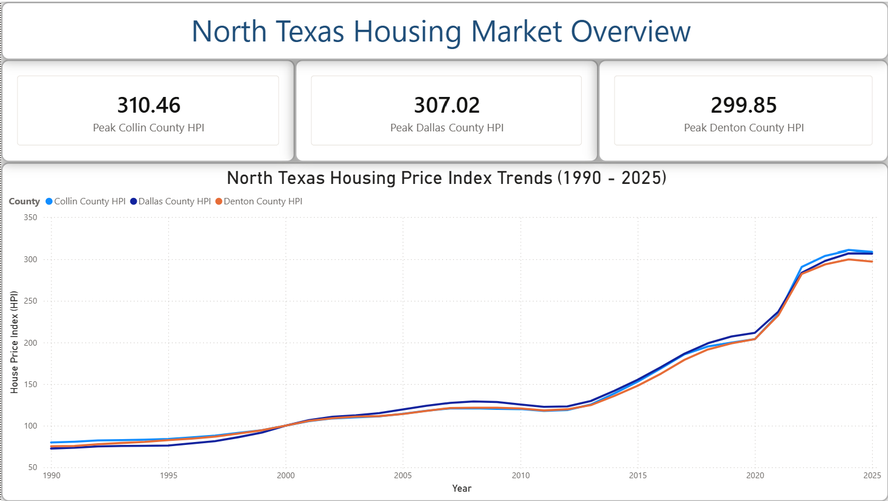
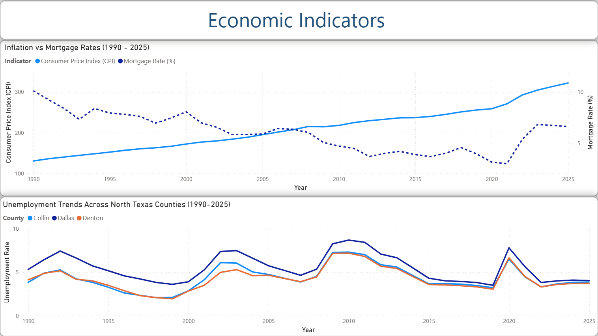
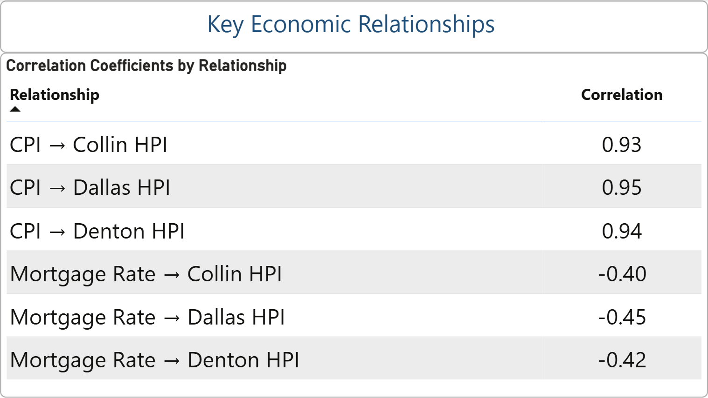
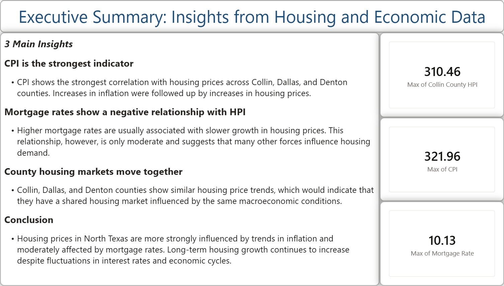

# North Texas Housing Market Analysis
**Tools:** Python, Pandas, Power BI, GitHub
## Project Overview

This project analyzes housing price trends across Collin, Dallas, and Denton counties and examines their relationship with inflation, mortgage rates, and unemployment from 1990–2025. Using Python for data preparation and Power BI for visualization, the project explores how macroeconomic indicators align with long-term housing market performance in North Texas.

## Objectives

* Analyze long-term housing price trends across selected North Texas counties.
* Examine relationships between housing prices and economic indicators.
* Compare housing market performance across Collin, Dallas, and Denton counties.
* Build an interactive Power BI dashboard to communicate findings.

## Data Sources

* Federal Housing Finance Agency House Price Index (HPI)
* Federal Reserve Bank of St. Louis Consumer Price Index (CPI)
* Mortgage Rate data
* County-level unemployment data

## Methodology

1. Collected housing and economic datasets from public sources.
2. Cleaned and standardized datasets using Python and Pandas.
3. Aggregated data to reflect annual observations.
4. Merged datasets into a unified analytical dataset.
5. Conducted correlation analysis between housing prices and economic indicators.
6. Developed a Power BI dashboard to present findings.

## Results

* Housing prices increased substantially across Collin, Dallas, and Denton counties over the study period.
* CPI exhibited a strong positive relationship with county housing price indexes (correlations ranging from approximately 0.93 to 0.95).
* Mortgage rates showed a moderate negative relationship with housing prices (correlations ranging from approximately -0.40 to -0.45).
* Housing price indexes across the three counties moved very closely together, with correlations exceeding 0.99.

## Dashboard Pages

### Housing Market Overview

Overview of housing price trends across Collin, Dallas, and Denton counties.

### Economic Indicators

Analysis of inflation, mortgage rates, and unemployment trends.

### Correlation Analysis

Summary of statistical relationships between housing prices and economic indicators.

### Executive Summary

Key insights and conclusions from the analysis.

## Tools & Technologies

* Python
* Pandas
* Jupyter Notebook (Google Colab)
* Power BI
* GitHub

## Repository Structure

* `data/raw/` – Original source data
* `data/cleaned/` – Cleaned and merged datasets
* `notebooks/` – Python analysis notebook
* `dashboard/` – Power BI dashboard file
* `images/` – Dashboard screenshots

## Future Enhancements

* Incorporate additional Texas counties in the North Texas area. 
* Develop predictive housing price models.
* Add forecasting and scenario analysis.
* Expand dashboard interactivity.
